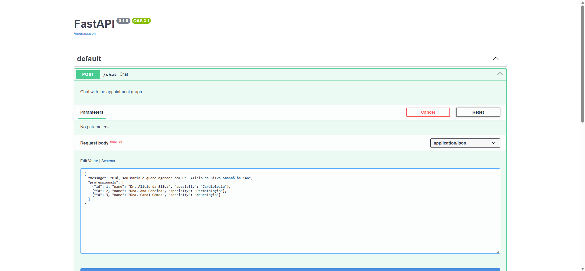
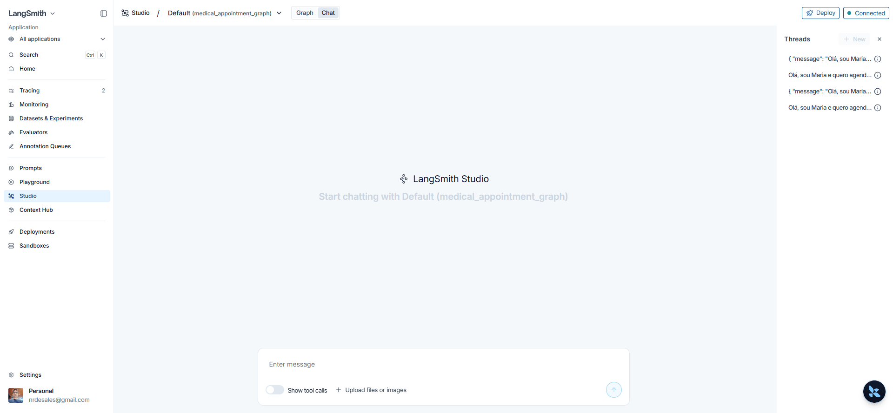

# medical-appointment-z

Assistente de agendamento médico com **FastAPI + LangGraph + LangChain**, em Python.

Versão em Python do template TypeScript do curso, para estudar os mesmos conceitos (intent, grafo, nós e tracing) na stack Python.

### Demo Swagger (`POST /chat`)



### Demo LangGraph Studio



## O que o projeto faz

Recebe uma mensagem do usuário e:

1. identifica a intenção (`schedule`, `cancel` ou `unknown`) via LLM
2. extrai dados (paciente, profissional, data/hora)
3. agenda ou cancela a consulta
4. gera a resposta final via LLM (tom de recepcionista médica)

## Stack

- Python 3.12+
- FastAPI
- LangGraph / LangChain
- OpenRouter (LLM)
- LangSmith / LangGraph Studio (observabilidade)
- Poetry + Pytest

## Estrutura

```text
medical-appointment-z/
├── app/
│   ├── main.py                 # API FastAPI (/chat)
│   ├── config.py               # env + LangSmith + OpenRouter
│   ├── models/                 # ModelConfig, IntentSchema, MessageSchema
│   ├── prompts/v1/             # prompts do classificador e do gerador de mensagens
│   ├── services/
│   │   ├── appointment_service.py
│   │   └── open_router_service.py
│   └── graph/
│       ├── factory.py          # DI: cria LLM + AppointmentService e monta o grafo
│       ├── graph.py            # StateGraph
│       └── nodes/              # identify / schedule / cancel / message
├── tests/
│   ├── conftest.py
│   ├── test_router_e2e.py
│   └── unit/                   # testes unitários
├── Dockerfile
├── docker-compose.yml
├── Makefile
├── langgraph.json              # registro do grafo no Studio
├── .env.example
├── .env
└── pyproject.toml
```

## Fluxo do grafo

```text
START
  → identify_intent
      ├─ schedule → scheduler → message → END
      ├─ cancel   → canceller → message → END
      └─ unknown / erro → message → END
```

## Setup

### 1. Ambiente

```bash
cd medical-appointment-z
pyenv activate medical-appointment-z   # se usar pyenv
make install
```

### 2. Variáveis de ambiente

```bash
cp .env.example .env
```

Preencha o `.env`:

```env
LANGSMITH_TRACING=true
LANGSMITH_API_KEY=sua_chave_langsmith
LANGSMITH_PROJECT=medical-appointment-z

OPENROUTER_API_KEY=sua_chave_openrouter
OPENROUTER_MODEL=openai/gpt-4o-mini
TEMPERATURE=0.2

OPENAI_API_KEY=sua_chave_openrouter
OPENAI_BASE_URL=https://openrouter.ai/api/v1
```

> `OPENAI_API_KEY` e `OPENAI_BASE_URL` apontam para o OpenRouter porque o cliente usado é o `ChatOpenAI` compatível com a API OpenAI.

## Rodar a API

### Local (Poetry)

```bash
make run
```

### Docker (API + LangGraph Dev)

```bash
make docker-up
```

Sobe os dois serviços:

- API: `http://127.0.0.1:8000/docs`
- LangGraph Dev: `http://127.0.0.1:2024`

Outros comandos úteis:

```bash
make docker-logs
make docker-studio-logs
make docker-down
make docker-shell
```

Endpoint:

```http
POST /chat
Content-Type: application/json
```

## Prompts do LLM

O grafo chama o LLM **duas vezes** (structured output via OpenRouter):

| Etapa | Arquivo | Schema | Papel |
|---|---|---|---|
| Classificar intent | `app/prompts/v1/identify_intent.py` | `IntentSchema` | Extrai `intent`, profissional, data/hora, paciente |
| Gerar resposta | `app/prompts/v1/message_generator.py` | `MessageSchema` | Mensagem final no tom de recepcionista |

### Cenários do gerador de mensagens

O node monta o `scenario` a partir do estado:

| Scenario | Quando |
|---|---|
| `schedule_success` | agendamento ok |
| `schedule_error` | falha ao agendar (horário ocupado, validação, etc.) |
| `cancel_success` | cancelamento ok |
| `cancel_error` | falha ao cancelar (não encontrado, paciente errado, etc.) |
| `unknown` | intent desconhecido ou erro no classificador |

Exemplos de resposta esperada (do próprio prompt):

- **schedule_success**: *"Sua consulta com o Dr. Alicio da Silva em 12 de fevereiro de 2026 às 16h foi confirmada para Maria Santos. Aguardamos sua visita!"*
- **cancel_error**: *"Não encontrei nenhuma consulta com essas informações. Por favor, verifique a data, o horário e o nome do médico."*
- **unknown**: *"Posso ajudá-lo(a) a agendar ou cancelar consultas médicas. Como posso ajudá-lo(a) com sua consulta hoje?"*

## Exemplos para testar

Profissionais padrão (seed):

| ID | Nome | Especialidade |
|---|---|---|
| 1 | Dr. Alicio da Silva | Cardiologia |
| 2 | Dra. Ana Pereira | Dermatologia |
| 3 | Dra. Carol Gomes | Neurologia |

Consultas já existentes no seed: Joao da Silva com Alicio **hoje às 11h**; Luana Costa com Ana Pereira **amanhã às 14h**.

### Swagger / `POST /chat`

Body alinhado ao TS: campo principal `question` (mín. 10 caracteres).  
`message` ainda é aceito como alias. `professionals` é opcional (melhoria do Python).  
A resposta é o **estado do grafo** (flat), não `{ "state": ... }`.

**Agendar** → cenário `schedule_success`

```json
{
  "question": "Olá, sou Maria Santos e quero agendar uma consulta com Dr. Alicio da Silva amanhã às 15h para um check-up regular",
  "professionals": [
    { "id": 1, "name": "Dr. Alicio da Silva", "specialty": "Cardiologia" },
    { "id": 2, "name": "Dra. Ana Pereira", "specialty": "Dermatologia" },
    { "id": 3, "name": "Dra. Carol Gomes", "specialty": "Neurologia" }
  ]
}
```

**Cancelar** (bate com o seed) → cenário `cancel_success`

```json
{
  "question": "Cancele minha consulta com Dr. Alicio da Silva que tenho hoje às 11h, me chamo Joao da Silva",
  "professionals": [
    { "id": 1, "name": "Dr. Alicio da Silva", "specialty": "Cardiologia" },
    { "id": 2, "name": "Dra. Ana Pereira", "specialty": "Dermatologia" },
    { "id": 3, "name": "Dra. Carol Gomes", "specialty": "Neurologia" }
  ]
}
```

**Cancelar com paciente errado** → cenário `cancel_error`

```json
{
  "question": "Cancele minha consulta com Dr. Alicio da Silva que tenho hoje às 11h, me chamo Outra Pessoa",
  "professionals": [
    { "id": 1, "name": "Dr. Alicio da Silva", "specialty": "Cardiologia" }
  ]
}
```

**Desconhecido** → cenário `unknown`

```json
{
  "question": "Qual a previsão do tempo amanhã?",
  "professionals": [
    { "id": 1, "name": "Dr. Alicio da Silva", "specialty": "Cardiologia" }
  ]
}
```

Exemplo com curl:

```bash
curl -X POST http://127.0.0.1:8000/chat \
  -H "Content-Type: application/json" \
  -d '{
    "question": "Olá, sou Maria Santos e quero agendar com Dr. Alicio da Silva amanhã às 15h",
    "professionals": [
      {"id": 1, "name": "Dr. Alicio da Silva", "specialty": "Cardiologia"},
      {"id": 2, "name": "Dra. Ana Pereira", "specialty": "Dermatologia"},
      {"id": 3, "name": "Dra. Carol Gomes", "specialty": "Neurologia"}
    ]
  }'
```

## Rodar testes

```bash
make test
```

Há testes unitários em `tests/unit/` (serviço, schema, OpenRouter mockado, nodes e roteamento).  
Os testes E2E usam stubs do `identify_intent` e do gerador de mensagens (sem chamar LLM), para ficarem determinísticos.

## LangGraph Studio

### 1. Instalar CLI (dev)

```bash
poetry add --group dev "langgraph-cli[inmem]"
```

### 2. Subir o Studio neste projeto

```bash
cd medical-appointment-z
make studio
```

No dropdown do Studio deve aparecer:

- `medical_appointment_graph`

### 3. Como testar no Studio

**Opção A — só texto** (usa a lista padrão de profissionais) → `schedule_success`

```text
Olá, sou Maria Santos e quero agendar com Dr. Alicio da Silva amanhã às 15h para um check-up
```

**Opção B — JSON no chat**

```json
{
  "message": "Olá, sou Maria Santos e quero agendar uma consulta com Dr. Alicio da Silva amanhã às 15h para um check-up regular",
  "professionals": [
    { "id": 1, "name": "Dr. Alicio da Silva", "specialty": "Cardiologia" },
    { "id": 2, "name": "Dra. Ana Pereira", "specialty": "Dermatologia" },
    { "id": 3, "name": "Dra. Carol Gomes", "specialty": "Neurologia" }
  ]
}
```

> No Studio o JSON vai no **content** da mensagem (por isso usa `message`). Na API HTTP o campo é `question`.

**Cancelar no Studio (texto)** → `cancel_success`

```text
Cancele minha consulta com Dr. Alicio da Silva que tenho hoje às 11h, me chamo Joao da Silva
```

**Desconhecido no Studio** → `unknown`

```text
Qual a previsão do tempo amanhã?
```

Dicas:

- use **New thread** a cada teste limpo
- não cancele o run no meio (pode deixar estado inconsistente)
- se `professionals` não vier, o grafo usa a lista padrão do `AppointmentService`
- a mensagem final vem do LLM (`message_generator`); o texto muda a cada run, mas o tom e o cenário devem bater
## Conceitos importantes

| Conceito | Onde está |
|---|---|
| Prompt de classificação | `app/prompts/v1/identify_intent.py` |
| Prompt da resposta final | `app/prompts/v1/message_generator.py` |
| Nó de intent (LLM) | `app/graph/nodes/identify_intent_node.py` |
| Agendamento | `app/graph/nodes/scheduler_node.py` |
| Cancelamento | `app/graph/nodes/canceller_node.py` |
| Resposta final (LLM) | `app/graph/nodes/message_generator_node.py` |
| Schema da mensagem | `app/models/message.py` |
| Estado do grafo | `app/graph/graph.py` (`GraphState`) |
| Factory / DI | `app/graph/factory.py` |
| Persistência in-memory | `app/services/appointment_service.py` |
| Cliente OpenRouter | `app/services/open_router_service.py` |
| Schema de intent | `app/models/intent.py` |

## Observabilidade

Com `LANGSMITH_TRACING=true`, as execuções aparecem no LangSmith no projeto configurado.

O Studio (`langgraph dev`) usa o `langgraph.json` para carregar o grafo localmente.

## Makefile

```bash
make help
make install
make run
make test
make studio
make docker-build
make docker-up
make docker-down
make docker-logs
```

## Observações

- O storage de consultas é **em memória** (reinicia ao reiniciar o processo/container).
- `reason` é opcional no agendamento; se omitido, usa `"general consultation"`.
- Campos obrigatórios para schedule/cancel: `professional_id`, `patient_name`, `datetime`.
- O cancelamento exige o **mesmo** `patient_name` da consulta (não cancela consulta de outra pessoa).
- A resposta final é gerada pelo LLM (não é mais mensagem fixa por regra).
- Os containers usam o `.env` via `docker-compose.yml` (API na porta `8000`, LangGraph Dev na `2024`).
